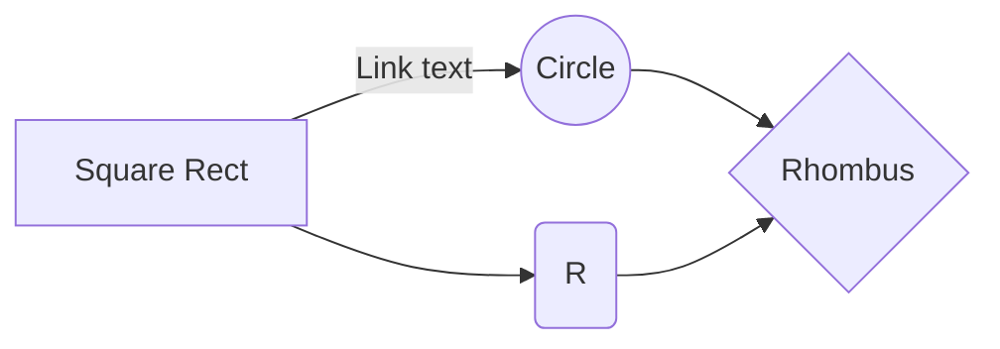
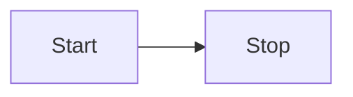
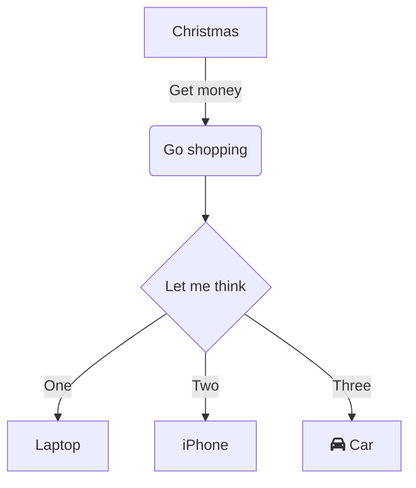

```mermaid
    graph LR
        A[Square Rect] -- Link text --> B((Circle))
        A --> C(R)
        B --> D{Rhombus}
        C --> D
```

```mermaid
    graph LR
        Start --> Stop
```

```mermaid
    graph TD
        A[Christmas]  -->|Get money| B(Go shopping)

        B --> C{Let me think}

        C -->|One| D[Laptop]

        C -->|Two| E[iPhone]

        C -->|Three| F[fa:fa-car Car]
```
